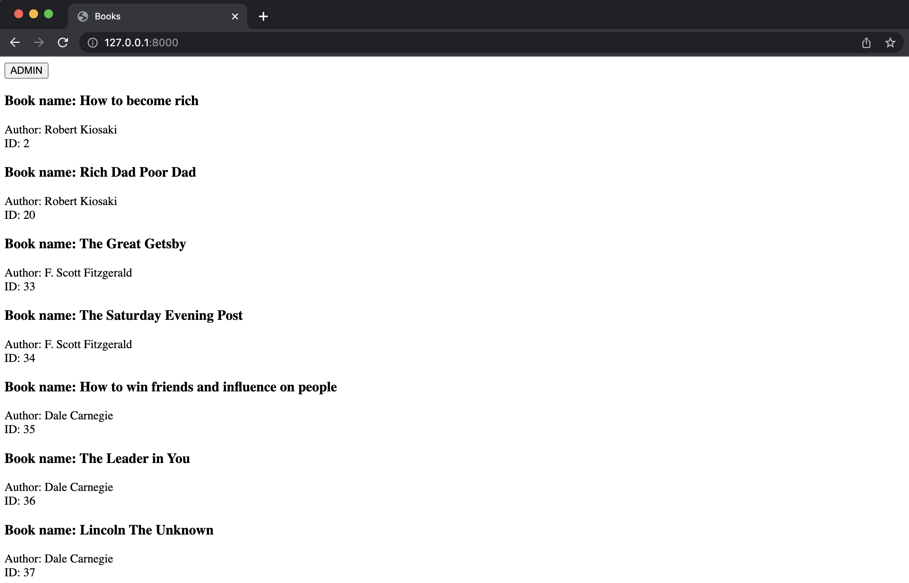
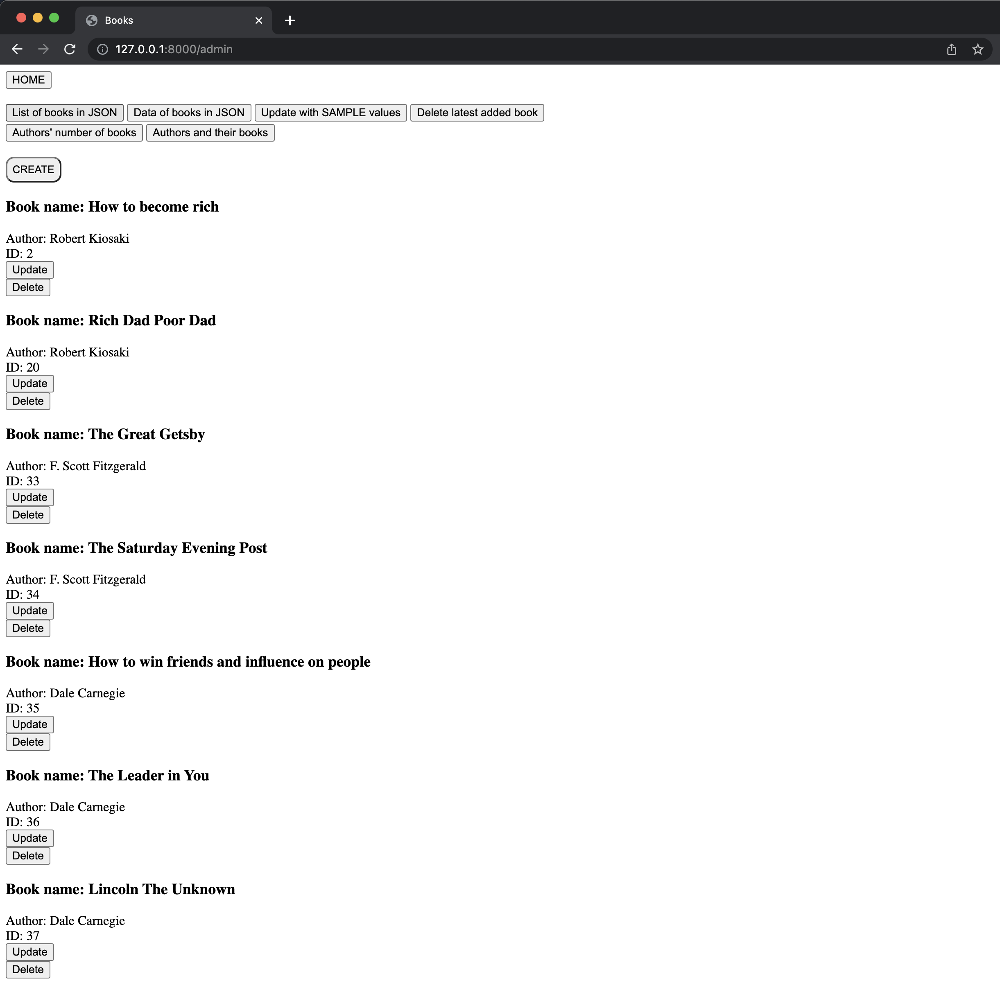
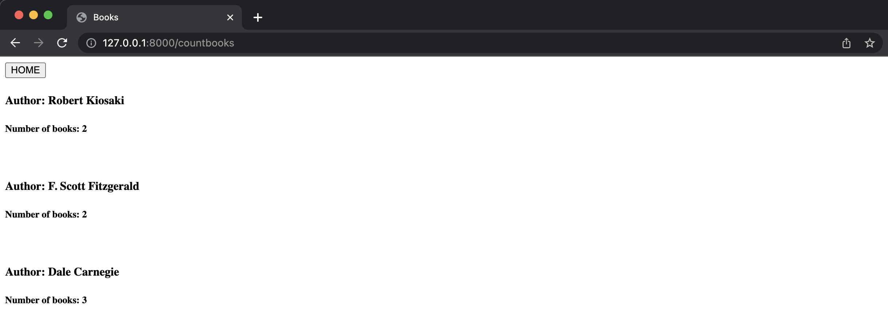
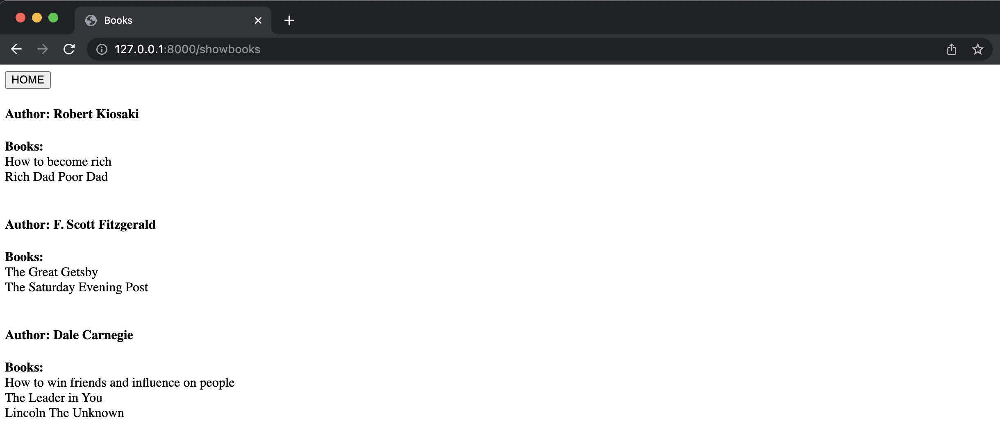
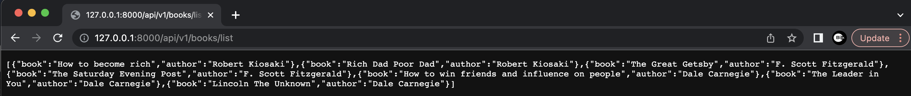
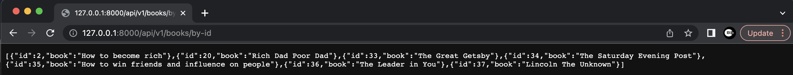
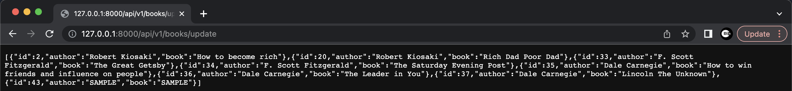
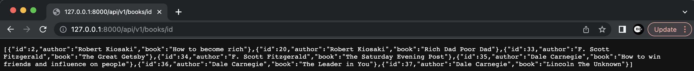
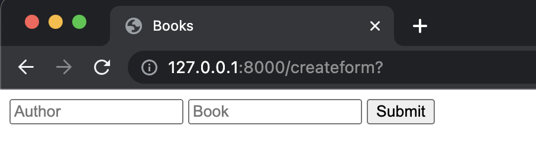

# Authors and Books using basics of Laravel(PHP)

## Requirements
- PHP 8.1.0
- MySQL 5.7.36
- Composer
- Laravel 9.0.1

## Getting Started

- Clone the project
```console
git clone ...
```

- Create and connect Database to the Project
In this project I used MySQL, however you can choose whichever you want (SQLite, PostgreSQL, etc)

- Create table in database 
```console
php artisan migrate
```

- Fill the table with sample data
```console
php artisan db:seed
```

- Run the program:
```console
php artisan serve
```
And open the shown url of LOCALHOST.

## Documentation

### Home Page
- In home page, all the books and their information is shown with a button to redirect to admin page.


### Admin Page
- Press the button ADMIN (The Admin page authorization is not setted to keep the project sample)


### Admin page cotains:

#### Button "Authors number of books"
- Shows who has how many books in the store.



#### Button "Authors and their books"
- Shows who has which books.



#### Button "List of books in JSON"
- Shows data in JSON with books and authors.



#### Button "DATA of books in JSON"
- Shows data in JSON with books and ids.



#### Button "Update with sample values"
- Updates books with author = 'SAMPLE' and book = 'SAMPLE'



#### Button "Delete latest added book"
- Deletes the last added book with the last added id.



#### Button "Create"
- Redirect to the new page to get new information for new post.



#### Buttons Update and Delete
- Used to Update and Delete every post.
